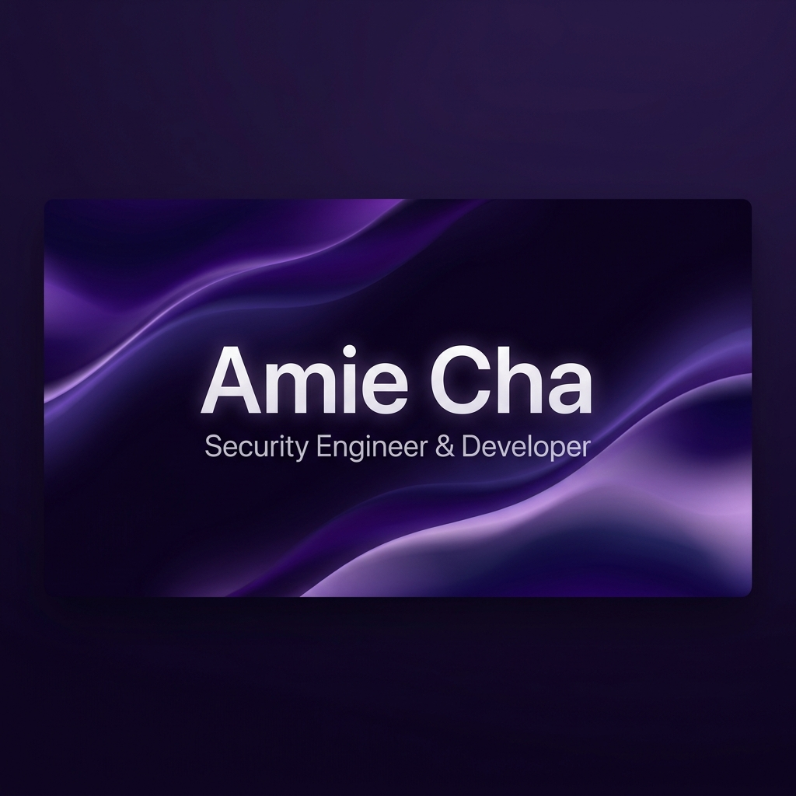

  

 

  <h1>💜 Hello, I'm Amie Cha! 💜</h1>
  
<strong>수원대학교 정보보호학과 | Security Engineer & Developer</strong>

  
기획과 발표에 강력한 강점을 가진 보안 엔지니어이자 개발자입니다. 보안과 개발의 경계를 허물며, 안전하고 신뢰할 수 있는 시스템 및 보안 제품을 설계하고 기획하는 것에 깊은 관심을 가지고 있습니다. 대부분의 팀 프로젝트에서 주도적으로 기획과 발표를 담당하며 프로젝트를 성공으로 이끌었습니다.

## 📌 About Me
- 🏫 **University**: 수원대학교 정보보호학과 (Information Security)
- 🔬 **Interests**: 시스템 해킹 (System Hacking) | 웹 해킹 (Web Hacking) | 암호학 (Cryptography) | 보안 제품 개발 (Security Product Development)
- 💡 **Strength**: **프로젝트 기획 및 발표 주도 🎤** (대부분의 프로젝트 기획 및 메인 발표 담당)
- 💡 **Motto**: "안전한 내일을 코딩하고 설계하는 보안 엔지니어"

---

## 🛠 Tech Stack

  <h3>💻 Languages & Tools</h3>
  <!-- Languages -->
  
  
  
  
  
  
  
   
  <!-- Web Frontend -->
  
  
  
  
   
  <!-- Security & Dev Tools -->
  
  
  

---

## 🏆 Projects & Hackathons
- 🎓 **2학년 정보보호학과 졸업 전시** — **대상 🏆** (기획 및 발표 주도)
- 💻 **임베디드 공모전** 및 **한이음 ICT 멘토링** 참여 (기획 및 발표 담당)
- ⚔️ **교내 바이브코딩 해커톤** 참가 (기획 및 발표 담당)
- 🛡️ **wubpurifier 그룹 프로젝트** (2025.07 ~ 2026.11) — **기획 및 발표 주도 🎤**

---

## 💼 Experience & Careers
- 🏢 **하이온넷 (HighONNet)** (2025.07 ~ 2026.01) — 인턴 (VPN 운영 및 네트워크 보안 기술 지원)
- 📊 **yd&s** (2026.02) — 인턴 (빅데이터 시각화 파트)
- 🎥 **NSHC** (2025.03.20 ~ 2025.05.10) — 네트워크 교육 영상 편집 및 제작 지원
- 🎮 **스타트업 플리더스 (Fliders)** (2024.01 ~ 2024.06) — 사업계획서 작성 및 게임 스테이지 기획 주도
- 📖 **GIS 활용 통계 프로그램 파이썬 코딩 과외** (2025.11) — 주도적 강의 진행

---

## 🏅 Certifications & Awards
- 📜 **PCCE 자격증** 취득
- 🏅 **교내 진로 커리어 로드맵** — **우수상 🏆**

---

## 📊 GitHub Stats

  
  

 

  <a href="mailto:82103@example.com">📧 Contact Me</a>

